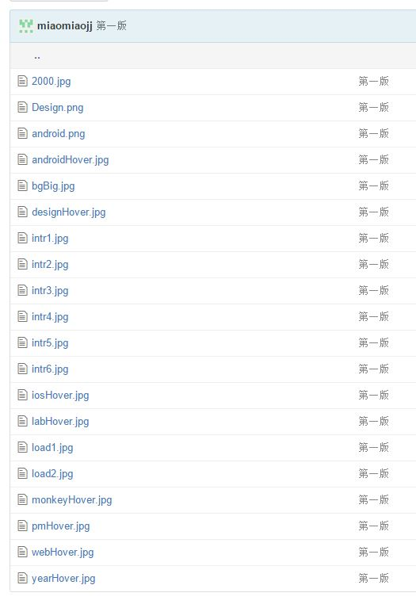
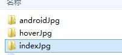

##常见问题##

1.命名规范:

	通常文件名不要用中文命名:
    
**问题代码**
>	 <link  rel="stylesheet" type="text/css" href="联创首页.css" />  //这里需要改一下
>	 <script type="text/javascript" src="联创首页.js"></script>

2.使用使用了条件判断语句后，应该了解清楚，什么时候禁止IE，还有禁止IE的哪几个版本:

**实例代码**

```
<!--[if IE]>
<link href="fontawesome-4.3.0/css/font-awesome-ie7.min.css" rel="stylesheet" />
<![endif]-->
```

**参考:**
[限制IE](http://www.cnblogs.com/dtdxrk/archive/2012/03/06/2381868.html)
然后上网搜索一下相关的资料
**要求:**
>不限制所有的IE，让上面的css只在IE9以上的版本显示,自己要测试通过哦~


3.CSS命名问题
>在css里面尽量使用class选择,减少使用#id选择的次数，因为很多时候都有可重复性，而且使用#id选择一般是在js里面的事件绑定的时候使用(虽然我在js里面也经常用 -.-, 不要学我+_+)

**问题代码**

```
.homepage-center{
	z-index: 2;
}
#load1{
	position: absolute;
    width: 29%;
    left: 35%;
    bottom: 43.5%;
    z-index: 4;
}
#load2Container{
    position: absolute;
    width: 29%;
    left: 35%;
    bottom: 44.5%;
    z-index: 2;
}

```

4.文件命名格式规范:
>一个工程项目给人第一印象就是他的文件夹的命名和架构
所以如果你的目录不清晰会给人点的冲动

**举个栗子吧**

==your图片目录==

**砖家点评**

:你绝壁是直接把他们的图下载下来直接用的.好像命名也是copy的，这点可以，不过要学习他们的命名,自己看看吧，是不是觉得自己的文件名与别人的，就像一个乡下人和城里人~,不过不要气馁了，因为这有大神们写了无数的规范

**建议:**
>**分文件夹!;&emsp;分文件夹!;&emsp;分文件夹!;**
>建个文件夹不要998,只要右键+w+f+name;
>将同个类型的图片分目录存放，如果项目如果很大时，将图片分路由网页文件夹存放;

**栗子**


走过路过不要错过: 少年看你天赋异禀, 送你几本教材，好好学习哈~
[Classification of CSS](http://nec.netease.com/standard/css-sort.html),
[Materliu的命名规范](http://materliu.github.io/code-guide/)

@copyRight By 坏人 in Bingyan studio 2015.11.9;